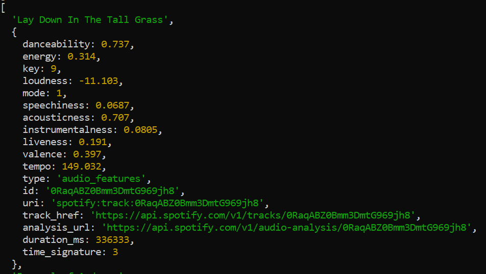
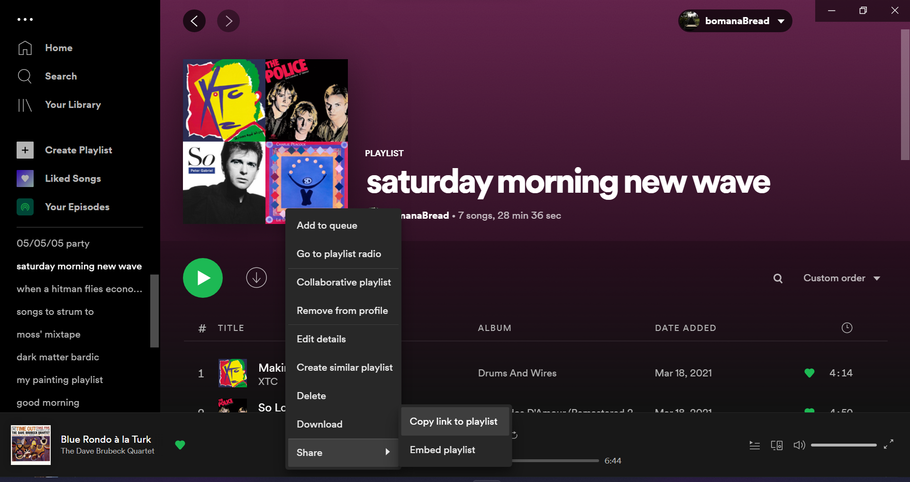
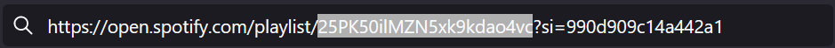

# playlist-analyzer
A node.js project that pulls data from the Spotify Web API and prints playlist data to the console. 
## Description
This is the start to what I hope will become a bigger project (maybe a web app) in the future! I wanted to learn how to pull data from a public API and become more familiar with JavaScript. I feel I have a much better understanding of asynchronous functions and Promises after doing this project. 

One of my favorite low-investment hobbies is creating playlists on Spotify. It's fun to try and find a line through songs that normally wouldn't go together, or try to change the mood of a playlist as a listener moves through it. A fond memory I have as a kid is my dad taking the time to create individualized mixtapes on CDs for me and my siblings when we were too little to use iTunes. 

My motivation going into this project was to learn more about how Spotify measures the audio qualities of a song and study how those qualities change over time across a playlist. It's a ways from being there yet, but in the meantime, here's a [cool Medium article](https://towardsdatascience.com/the-art-of-creating-a-mixtape-a-data-science-approach-1902065b1d1d) that talks about mixtapes and the various measured audio features of Spotify tracks. 

## Usage
[Node.js](https://nodejs.org/en/) is necessary to run this project, as are your own [Spotify client credentials](https://developer.spotify.com/dashboard/). 
- Download both .js files into the same directory. 
- Edit apiRequests.js and substitute your client credentials for 'process.env.SPOTIFY_CLIENT_ID' and 'process.env.SPOTIFY_CLIENT_SECRET.' 
- Edit consoleFunctions.js by adding your own track or playlist IDs to the function call arguments.
- Open any terminal, navigate to the directory that holds the .js files and run:
```
node consoleFunctions.js
```
<details open>
<summary>Expected output</summary>
<br>
  
</details>

To find the track or playlist ID of a song or playlist in Spotify, select the three dots (...) next to the playlist or song and navigate to Share > Copy Link to Playlist/Song
<details>
<summary>Screenshot</summary>
<br>
  
</details>

Paste that link into a web browser and copy this portion:
  

## Credits
- Thanks to Ritvik Biswas for his [very helpful Medium article](https://ritvikbiswas.medium.com/connecting-to-the-spotify-api-using-node-js-and-axios-client-credentials-flow-c769e2bee818) on how to perform the client credentials flow to acesss the Spotify API with the axios library 
- [Spotify's Web API documentation](https://developer.spotify.com/documentation/web-api/)
